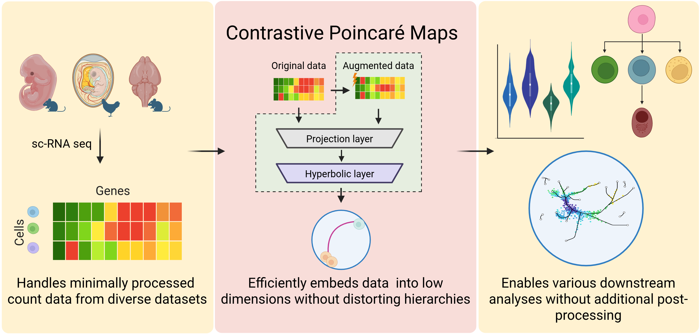

# Contrastive Poincaré Maps

Contrastive Poincaré Maps is an efficient, low-distortion embedding method that handles minimally 
processed transcriptomic data from a wide range of specimens and supports multiple downstream analyses without further 
post-processing, delivering especially strong performance in lineage detection applications. 

<figure>
  
  <figcaption> Figure was created in BioRender. Bhasker, N. (2025) https://BioRender.com/t83d482</figcaption>
</figure>

## Dependencies

To install the dependencies, use the [requirements.txt](requirements.txt) file:
```
pip install -r requirements.txt
```

## Usage
The model requires count matrix (cells x genes) in csv format. Do not use ".csv" while feeding the data name in 
the arguments. There are two ways to train the model. 

#### Option 1 
```
Usage: main.py --config <path to config file>

Arguments:
<path to config file> The txt file containing the hyperparameters

Options:
  --config                 Path to config file
```


#### Option 2
```
Usage: main.py [--config CONFIG] [--corr_rate CORR_RATE] [--emb_dim EMB_DIM] 
               [--n_enc_layers N_ENC_LAYERS] [--n_hyp_layers N_HYP_LAYERS] 
               [--lr_proj LR_PROJ] [--lr_hyp LR_HYP] [--n_epochs N_EPOCHS] 
               [--early_stop EARLY_STOP] [--batch_size BATCH_SIZE] 
               [--n_comp_PCA N_COMP_PCA] [--normalise NORMALISE] 
               [--data_dir DATA_DIR] [--fname FNAME]
               [--root ROOT] [--res_dir RES_DIR]

Options:
  --config                 Path to config file
  --corr_rate              Rate of feature perturbation (range 0 to 1)
  --emb_dim                Embedding dimension
  --n_enc_layers           Number of encoder layers
  --n_hyp_layers           Number of hyperbolic layers
  --lr_proj                Learning rate for projection layers
  --lr_hyp                 Learning rate for hyperbolic layers
  --n_epochs               Number of epochs
  --early_stop             Early stopping criterion
  --batch_size             Batch size
  --n_comp_PCA             Number of PCA components; None if disabled
  --normalise              Apply z-transform?
  --data_dir               Path to the data directory
  --fname                  Name of the dataset file
  --root                   Root name
  --res_dir                Path to the results directory
```

The following hyperparameters are a good choice for most use cases

```
python main.py --config <config_dict.txt>

config_dict:
{
  "corr_rate": 0.2,
  "emb_dim": 128,
  "n_enc_layers": 1,
  "n_hyp_layers": 1,
  "lr_proj": 1e-3,
  "lr_hyp": 1e-4,
  "n_epochs": 1000,
  "early_stop": 1e-3,
  "batch_size": 128,
  "data_dir": "path/to/your/data/",
  "fname": "data_file_name",
  "root": "root_name",
  "res_dir": "path/to/store/results/"
}
```


## Citation
Bhasker, N., Chung, H., Boucherie, L., Kim, V., Speidel, S., & Weber, M. (2025). 
Uncovering Developmental Lineages from Single-cell Data with Contrastive Poincaré Maps. 
bioRxiv, 2025-08. https://doi.org/10.1101/2025.08.22.671789

## Results
The trained models and CPM embeddings for the real-world datasets can be found [here](./examples/results).

## Examples
The examples for visualisation, canonical ordering, phylogenetic tree and gene expression plots are available 
[here](./examples/). 

## References
1. https://github.com/facebookresearch/PoincareMaps
2. https://github.com/clabrugere/pytorch-scarf/tree/master
3. https://github.com/HazyResearch/hgcn/tree/master

## Acknowledgements
NB is funded by the German Federal Ministry of Health (BMG) within the “Surgomics” project
(Grant Number: BMG 2520DAT82) and partially by the German Federal Ministry of Education
and Research (BMBF) within the DAAD Konrad Zuse AI school SECAI (School of Embedded
Composite AI, https://secai.org/) (Project number: 57616814). MW was funded by NSF
awards CBET-2112085 and DMS-2406905, and a Sloan Research Fellowship in Mathematics.

## Contact
If you have any questions, contact us at: nithya.bhasker@nct-dresden.de or mweber@seas.harvard.edu
